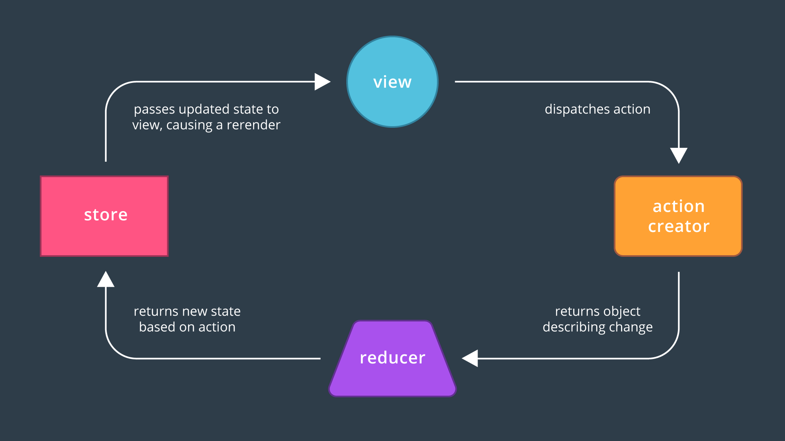

# **_ES6 / React Running Notes_**

<!-- MarkdownTOC -->

1.  Hoisting
-  let and const
-  let vs const
-  Destructuring
  - Elision
  - Spread operator
  - Rest operator \(...\)
  - Variadic functions
-  Loops
-  forEach vs map
-  [Convert function to an arrow function](https://youtu.be/CM4j786p3Vs)
-  Function declaration vs function expression
-  bind/call/apply
- [Functional Programming](https://medium.com/javascript-scene/master-the-javascript-interview-what-is-functional-programming-7f218c68b3a0)
  -  Arrow vs Regular functions
-  Default function parameters are available with ES6
-  ES5 Classes
-  Subclasses with ES6
  - super must be called before this
-  React Virtual Dom
  - createElement Returns One Root Element
  - JSX Returns One Root Element, Too
-   React
  - Elements
  - React elements are immutable.
  - Intro to Components
  - Pass Data with props
-  setState
  - setState\((prevState\) => \({count : prevState.count+1}\)) -
  - setState\({username:'srikanth'}\)
- Whenever setState is invoked React by default rerenders entire application and updates the UI
- In React 'Your UI is just a function of your State'
  - State updates can be asynchronous ie setState can accept a function with the previous state as its first argument
  - setState should not be called within the component's render function
-  proptypes
-  render method
  - Pure Function
  - componentWillMount:
  - componentDidMount:
  - componentWillUnmount:
  - componentWillReceiveProps:
- _Adding to the DOM_
- _Re-rendering_
- _Removing from the DOM_
- BrowserRouter
- [Route](https://github.com/ReactTraining/react-router/commit/9143c650773c9b6350a78c473d953005a37574e7)
  - Route's exact flag
- [Redux](https://redux.js.org/)
  - [Three principles](https://github.com/reactjs/redux/blob/master/docs/introduction/ThreePrinciples.md#state-is-read-only)
- [Refs and the DOM](https://reactjs.org/docs/refs-and-the-dom.html)
- [Normalising state shape](https://redux.js.org/docs/recipes/reducers/NormalizingStateShape.html)
- [React Context API](https://reactjs.org/docs/context.html)
- REFERENCES:

<!-- /MarkdownTOC -->

# 1. Hoisting
is a result of how JavaScript is interpreted by your browser. Essentially, before any JavaScript code is executed, all variables are "hoisted", which means they're raised to the top of the function scope. So at run-time, the getClothing() function

function getClothing(isCold) {
  if (isCold) {
    var freezing = 'Grab a jacket!';
  } else {
    var hot = 'It’s a shorts kind of day.';
    console.log(freezing);
  }
}

actually looks more like this…

function getClothing(isCold) {
    var freezing, hot;
  if (isCold) {
    freezing = 'Grab a jacket!';
  } else {
    hot = 'It’s a shorts kind of day.';
    console.log(freezing);
  }
}

# 2.let and const
Variables declared with let and const eliminate this specific issue of hoisting because they’re scoped to the block, not to the function. Previously, when you used var, variables were either scoped globally or locally to an entire function scope.

If a variable is declared using let or const inside a block of code (denoted by curly braces { }), then the variable is stuck in what is known as the temporal dead zone until the variable’s declaration is processed. This behavior prevents variables from being accessed only until after they’ve been declared.

# 3. let vs const
Rules for using let and const i.e, let vs const
Variables declared with let can be reassigned, but can’t be redeclared in the same scope.
Variables declared with const must be assigned an initial value, but can’t be redeclared in the same scope, and can’t be reassigned.

# 4. Destructuring
Destructuring from an array:
const point = [10, 25, -34];
const [x, y, z] = point

Destructuring from an object:
const gemstone = {
  type: 'quartz',
  color: 'rose',
  karat: 21.29
};
const {type, color, karat} = gemstone;

caveats:
When you destructure the object and store the getArea() method into the getArea variable, it no longer has access to 'this' in the circle object which results in an area that is NaN.

More [Array destructuring features](http://exploringjs.com/es6/ch_destructuring.html):
## Elision
Elision lets you use the syntax of Array “holes” to skip elements during destructuring:
const [,, x, y] = ['a', 'b', 'c', 'd']; // x = 'c'; y = 'd'

## Spread operator
The spread operator, written with three consecutive dots ( ... ), is new in ES6 and gives you the ability to expand, or spread, iterable objects into multiple elements.

## Rest operator (...)
The rest parameter, also written with three consecutive dots ( ... ), allows you to represent an indefinite number of elements as an array. This can be helpful in a couple of different situations.
One situation is when assigning the values of an array to variables. For example,
const order = [20.17, 18.67, 1.50, "cheese", "eggs", "milk", "bread"];
const [total, subtotal, tax, ...items] = order;
console.log(total, subtotal, tax, items);

## Variadic functions
Another use case for the rest parameter is when you’re working with variadic functions. Variadic functions are functions that take an indefinite number of arguments.

let type = 'quartz';
let color = 'rose';
let carat = 21.29;

const gemstone = {
  type,
  color,
  carat,
  calculateWorth: function() {
    // will calculate worth of gemstone based on type, color, and carat
  }
};

can be written as

const gemstone = {
  type,
  color,
  carat,
  calculateWorth() {
    // will calculate worth of gemstone based on type, color, and carat
  }
};

# 5. Loops
a.The forEach() method executes a provided function once for each array element.
forEach() executes the provided callback once for each element present in the array in ascending order. It is not invoked for index properties that have been deleted or are uninitialized (i.e. on sparse arrays).callback is invoked with three arguments:
-the element value
-the element index
-the array being traversed

b.The for...of loop also has some additional benefits that fix the weaknesses of the for and for...in loops.You can stop or break a for...of loop at anytime.

const digits = [0, 1, 2, 3, 4, 5, 6, 7, 8, 9];

for (const digit of digits) {
  if (digit % 2 === 0) {
    continue;
  }
  console.log(digit);
}

# 6. forEach vs map:
The important difference between them is that map accumulates all of the results into a collection, whereas foreach returns nothing. map is usually used when you want to transform a collection of elements with a function, whereas foreach simply executes an action for each element.

# 7. [Convert function to an arrow function]https://youtu.be/CM4j786p3Vs
With the function above, there are only a few steps for converting the existing "normal" function into an arrow function.
    remove the function keyword
    remove the parentheses
    remove the opening and closing curly braces
    remove the return keyword
    remove the semicolon
    add an arrow ( => ) between the parameter list and the function body
# 8. Function declaration vs function expression
   function bar() {} - function declaration
   var a = function(){} / var a = function bar(){} - function expression.
   Arrow functions are function expressions

   **Function declaration**:
   The function name is visible within it’s scope and the scope of it’s parent (which is good because otherwise it would be unreachable)Function declaration is hoisted with the entire body being
   hosted along with it.

   Function expressions:
   var bar = function() {
    return 3;
};
Variable Declarations get hoisted but their Assignment Expressions don’t. So when bar is hoisted the interpreter initially sets var bar = undefined. The function definition itself is not hoisted.
(ECMA 5 12.2) A variable with an initializer is assigned the value of its AssignmentExpression when the VariableStatement is executed, not when the variable is created.

# 9. bind/call/apply:
  The bind() method creates a new function that, when called, has its this keyword set to the provided value. It creates a copy of the function.

  var pokemon = {
      firstname: 'Pika',
      lastname: 'Chu ',
      getPokeName: function() {
          var fullname = this.firstname + ' ' + this.lastname;
          return fullname;
      }
  };
  var pokemonName = function() {
      console.log(this.getPokeName() + 'I choose you!');
  };
var logPokemon = pokemonName.bind(pokemon); // creates new object and binds pokemon. 'this' of pokemon === pokemon now
logPokemon(); // 'Pika Chu I choose you!'

Call(): we can call any function, and explicitly specify what this should reference within the calling function. Similar to bind() but accepts additional
parameters,executes the function right away and does not make a copy unlike bind.

call() and apply() serve the exact same purpose. The only difference between how they work is that call() expects all parameters to be passed in individually, whereas apply() expects an array of all of our parameters.

pokemonName.call(pokemon,'sushi', 'algorithms'); // Pika Chu  loves sushi and algorithms
pokemonName.apply(pokemon,['sushi', 'algorithms']); // Pika Chu  loves sushi and algorithms

# 10. Arrow vs Regular functions
With regular functions, the value of this is set based on how the function is called. With arrow functions, the value of this is based on the function's surrounding context. In other words, the value of this inside an arrow function is the same as the value of this outside the function.

# 11. Default function parameters are available with ES6
    - function greet(name = 'Student', greeting = 'Welcome')
    - function createGrid([width = 5, height = 5] = []) {} will not accept createGrid() along with createGrid([])/createGrid([2])/createGrid([undefined,3])
    - function createSundae({scoops = 1, toppings = ['Hot Fudge']} = {}) {}
    will not accept createGrid() along with createGrid({})/createGrid({scoops:2})/createGrid([scoops:2,{toppings:'buttersotch'}])/createGrid({toppings:'oreo'})
ince arrays are positionally based, we have to pass undefined to "skip" over the first argument (and accept the default) to get to the second argument.

# 12. ES5 Classes
function Plane(numEngines) {
  this.numEngines = numEngines;
  this.enginesActive = false;
}

// methods "inherited" by all instances
Plane.prototype.startEngines = function () {
  console.log('starting engines...');
  this.enginesActive = true;

  - In the code above, the Plane function is a constructor function that will create new Plane objects. The data for a specific Plane object is passed to the Plane function and is set on the object. Methods that are "inherited" by each Plane object are placed on the Plane.prototype object.Some things to be noted:
  -
  -the constructor function is called with the new keyword
  -the constructor function, by convention, starts with a capital letter
  -the constructor function controls the setting of data on the objects that will be created
  -"inherited" methods are placed on the constructor function's prototype object

ES6 Class
class Plane {
  constructor(numEngines) {
    this.numEngines = numEngines;
    this.enginesActive = false;
  }

  startEngines() {
    console.log('starting engines…');
    this.enginesActive = true;
  }

### static badWeather(planes) {
    for (plane of planes) {
      plane.enginesActive = false;
    }
  }
}
 - typeof Plane Returns:function :)
 - As with any static method, it is accessed on the class i.e., Place.badWeather(planes)/Place.badWeather([plane1, plane2, plane3])

- class is a mirage over prototypal inheritance.We've said this many times before, but under the hood, a JavaScript class just uses prototypal inheritance.
-  Using classes requires the use of new.When creating a new instance of a JavaScript class, the new keyword must be used

# 13 Subclasses with ES6
class Tree {
  constructor(size = '10', leaves = {spring: 'green', summer: 'green', fall: 'orange', winter: null}) {
    this.size = size;
    this.leaves = leaves;
    this.leafColor = null;
  }

  changeSeason(season) {
    this.leafColor = this.leaves[season];
    if (season === 'spring') {
      this.size += 1;
    }
  }
}

class Maple extends Tree {
  constructor(syrupQty = 15, size, barkColor, leaves) {
    super(size, barkColor, leaves);
    this.syrupQty = syrupQty;
  }

  changeSeason(season) {
    super.changeSeason(season);
    if (season === 'spring') {
      this.syrupQty += 1;
    }
  }

  gatherSyrup() {
    this.syrupQty -= 3;
  }
}

const myMaple = new Maple(15, 5);
myMaple.changeSeason('fall');
myMaple.gatherSyrup();
myMaple.changeSeason('spring');

Compared to ES5 subclasses:
Same functionality, but written in ES5 code:

function Tree() {
  this.size = size || 10;
  this.leaves = leaves || {spring: 'green', summer: 'green', fall: 'orange', winter: null};
  this.leafColor;
}

Tree.prototype.changeSeason = function(season) {
  this.leafColor = this.leaves[season];
  if (season === 'spring') {
    this.size += 1;
  }
}

function Maple (syrupQty, size, barkColor, leaves) {
  Tree.call(this, size, barkColor, leaves);
  this.syrupQty = syrupQty || 15;
}

Maple.prototype = Object.create(Tree.prototype);
Maple.prototype.constructor = Maple;

Maple.prototype.changeSeason = function(season) {
  Tree.prototype.changeSeason.call(this, season);
  if (season === 'spring') {
    this.syrupQty += 1;
  }
}

Maple.prototype.gatherSyrup = function() {
  this.syrupQty -= 3;
}

const myMaple = new Maple(15, 5);
myMaple.changeSeason('fall');
myMaple.gatherSyrup();
myMaple.changeSeason('spring');

## super must be called before this
http://2ality.com/2015/02/es6-classes-final.html#

# 14 React Virtual Dom
React is a fantastic library not a framework.

## createElement Returns One Root Element
These arent real dom elements, these are just javascript objects that describe real dom nodes.
### React.createElement( _type_ ,  _props_ ,  _content_ )
List item elements should be given a unique key prop

## JSX Returns One Root Element, Too
When writing JSX, keep in mind that it must only return a single element. This element may have any number of descendants, but there must be a single root element wrapping your overall JSX (typically a 
 or a ).

JSX is really just a syntax extension for .createElement(), this makes sense; .createElement() takes in only one tag name (as a string) as its first argument. The JSX gets compiled down to calls to React's .createElement() method that outputs HTML to be rendered in the browser.

# 15.
## 15a Elements
Unlike browser DOM elements, React elements are plain objects. React DOM takes care of updating the DOM to match the React elements.Elements are what components are “made of”.
## React elements are immutable.
Once you create an element, you can’t change its children or attributes. An element is like a single frame in a movie: it represents the UI at a certain point in time.So far, the only way to update the UI is to create a new element, and pass it to ReactDOM.render().
React DOM compares the element and its children to the previous one, and only applies the DOM updates necessary to bring the DOM to the desired state.

## 15b Intro to Components
Components are like JavaScript functions. They accept arbitrary inputs (called “props”) and return React elements describing what should appear on the screen.

Components refer to reusable pieces of code ultimately responsible for returning HTML to be rendered onto the page.  

class ContactList extends React.Component {} or

import React, { Component } from 'react';
class ContactList extends Component {}

## 15c Pass Data with props
Any attribute that is passed to the component can be accessed on the props object inside thec omponent using {this.props.<>}
# 16 setState
By mutating the state directly react would have no idea that the state of the application has changed. There are two ways to use setState
### setState((prevState) => ({count : prevState.count+1})) -
Object returned from this function will be merged with the current state to form the new state of the component. Current statea would be depending on the previous state.
### setState({username:'srikanth'})
pass an object which would be merged with the current state. Otherwise pass the object

**Whenever setState is invoked React by default rerenders entire application and updates the UI**

### In React _Your UI is just a function of your State_
State reflects mutable information that ultimately affects rendered output, a component may also update its state throughout its lifecycle using this.setState(). As we've learned, every time local state changes, React will trigger a re-render of the component by calling its render() method.
 - ** State updates can be asynchronous ie setState can accept a function with the previous state as its first argument **
 - ** setState should not be called within the component's render function **

# 17. proptypes
import PropTypes from 'prop-types';
<className.propTypes = {
  <prop1> : PropTypes.array.isRequired
  <prop2> : PropTypes.func.isRequired
  <prop3> : PropTypes.string.isRequired
}
Regulates the data types of props of a class.

# 18. render method
render() shouldn't do AJAX requests or anything that is asynchronous in nature.
It should only receive props and give description of the UI.
Data should not be fetch in render() method.
- No fetching data
- no http/AJAX requests because you dont have complete control over when the render method will be invoked
- should not call any other functions that do any of the things above
- The render method should take in input via props, and return a description of your UI (JSX), nothing else.The render method should be a 'pure function'
- Life cycle events like below should do the above mentioned things on behalf of render() method

### [Pure Function](https://medium.com/javascript-scene/master-the-javascript-interview-what-is-a-pure-function-d1c076bec976)
A pure function doesn’t depend on and doesn’t modify the states of variables out of its scope.
s

### componentWillMount
invoked immediately before the component is inserted in the DOM
### componentDidMount
invoked immediately after the component is inserted in the DOM
componentDidMount() is invoked immediately after a component is mounted (which means after it is rendered). Initialization that requires DOM nodes should go here. If you need to load data from a remote endpoint, this is a good place to instantiate the network request. Setting state in this method will trigger a re-rendering.
 If you need to dynamically fetch data or run an Ajax request, you should do it in componentDidMount().
### componentWillUnmount
invoked immediately after the component is removed from the DOM
### componentWillReceiveProps
invoked whenever the component is about to receive brand new props
## _Adding to the DOM_
These lifecycle events are called when a component is being added to the DOM:
- constructor()
- componentWillMount()
- render()
- componentDidMount()
## _Re-rendering_
These lifecycle events are called when a component is re-rendered to the DOM
- componentWillReceiveProps()
- shouldComponentUpdate()
- componentWillUpdate()
- render()
- componentDidUpdate()
## _Removing from the DOM_
This lifecycle event is called when a component is being removed from the DOM
- componentWillUnmount()
# BrowserRouter
### Route
Difference between render() and component() is that when you use component we actually create a new React element for you. When you use render, we don't. So your component tree is different depending on which one you use.Also, try using render when you have props to be passed to the component.
(Use a component when you just want to render a component probably without passing any props??- Need to verify this last claim )
Please refer https://github.com/ReactTraining/react-router/commit/9143c650773c9b6350a78c473d953005a37574e7
### Route's exact flag
Components wrapped in the Router component will only render when it matches (at least some initial part of) the URL. If the **_exact_** flag is set, the path will only match when it exactly matches the URL.
# Redux
Redux improves predictability in a number of ways
- It consolidates most data to one location
- Components have to request access to data
- Data in the store flows in one direction
- Strict rules on how the store can be updated
### Three principles of redux
- Single source of truth.The [state](https://github.com/reactjs/redux/blob/master/docs/Glossary.md#state) of your whole application is stored in an object tree within a single [store](https://github.com/reactjs/redux/blob/master/docs/Glossary.md#store).
- State is read-only .The only way to change the state is to emit an [action](https://github.com/reactjs/redux/blob/master/docs/Glossary.md#action), an object describing what happened
- Changes are made with pure functions.To specify how the state tree is transformed by actions, you write pure [reducers](https://github.com/reactjs/redux/blob/master/docs/Glossary.md#reducer).
### Redux store
- store uses unidirectional data flow
- store contains all/most application Data
- store is **not** a regular Javascript array
- store has strict rules on how store can be updated

### Redux store vs React state
**Redux Store**
Generally, if state is shared and accessible through the whole app, it should be kept in the store. Examples include
- Cached users
- A draft of an email

**Component state**
On the other hand, if more "localized" data is involved, or you're dealing with state that doesn’t affect other components, component state is a solid choice. Examples include
- Form input
- Current tab selected
- Dropdown open/closed status

### Pure functions
- Return one and the same result if the same arguments are passed in
- Depend solely on the arguments passed into them
- Do not produce side effects

Below square is a pure function
const square = x => x * x;  __//Pure function__

Below calculateTip() is an impure function because it depends on an external variables
which is tipPercentage
const tipPercentage = 0.15
const calculateTip = cost => cost * tipPercentage;

Another example, array.slice() is a pure function but array.splice() is not one

Pure functions donot produce side effects. Side effects are interactions between a function and the world outside of it. This includes:
- Making HTTP calls
- Mutating external state
- Retrieving today’s date (won't return the same output always)
- Math.random() (won't return the same output always)
- Printing a message to the console (interaction with outside component)
- Adding to a database(interaction with outside component)
### Flow of data
Application data lives in the store.
  - Store is populated by reducer.
  - Action is dispatched by the store
  - Action is used by reducer to determine what data they should output to the store
There can more than one action/reducer for an application

## action creators
Plain objects aren't very portable, so in order to make actions more portable and easy to test, they’re usually wrapped in functions called "action creators"
## reducers
Reducer is going to specify the shape of the store.
##
## Refs and the DOM
props are the only way parent components interact with the child.To modify a child,
we re-render with new props.However, there are a few cases where you need to imperatively modify a child outside of the typical dataflow. The child to be modified could be **an instance of a React component**, or it could be **a DOM element**. For both of these cases, React provides an escape hatch.

##### Ref to a dom element ####
When the ref attribute is used on an HTML element, the ref callback receives the underlying DOM element as its argument.
~~~~
class CustomTextInput extends React.Component {
  constructor(props) {
    super(props);
    this.focusTextInput = this.focusTextInput.bind(this);
  }

  focusTextInput() {
    // Explicitly focus the text input using the raw DOM API
    this.textInput.focus();
  }

  render() {
    // Use the `ref` callback to store a reference to the text input DOM
    // element in an instance field (for example, this.textInput).
    return (
      

        <input
          type="text"
          ref={(input) => { this.textInput = input; }} />
        <input
          type="button"
          value="Focus the text input"
          onClick={this.focusTextInput}
        />
      

    );
  }
}
~~~~
React will call the ref callback with the DOM element when the component mounts, and call it with null when it unmounts. ref callbacks are invoked before componentDidMount or componentDidUpdate lifecycle hooks

##### Adding a Ref to a Class Component
When the ref attribute is used on a custom component declared as a class, the ref callback receives the mounted instance of the component as its argument. For example, if we wanted to wrap the CustomTextInput above to simulate it being clicked immediately after mounting:
~~~~
class AutoFocusTextInput extends React.Component {
  componentDidMount() {
    this.textInput.focusTextInput();
  }

  render() {
    return (
      <CustomTextInput
        ref={(input) => { this.textInput = input; }} />
    );

~~~~
Note that this would work only if CustomTextInput is declared as a class.

##### Refs and functional Components
You may not use ref attributes on functional components because they dont have instances.You should convert the component to a class if you need a ref to it, just like you do when you need lifecycle methods or state.
You can, however, **use the _ref_ attribute inside a functional component** as long as you refer to a DOM element or a class component:
~~~~
function CustomTextInput(props) {
  // textInput must be declared here so the ref callback can refer to it
  let textInput = null;

  function handleClick() {
    textInput.focus();
  }

  return (
    

      <input
        type="text"
        ref={(input) => { textInput = input; }} />
      <input
        type="button"
        value="Focus the text input"
        onClick={handleClick}
      />
    

  );  
}
~~~~

### React Context API
In some cases, you want to pass data through the component tree without having to pass the props down manually at every level. You can do this directly in React with the powerful “context” API.
# REFERENCES:
 - [Functional Programming - Interview Questions](https://medium.com/javascript-scene/master-the-javascript-interview-what-is-functional-programming-7f218c68b3a0)
 - [Function arguments object](https://developer.mozilla.org/en-US/docs/Web/JavaScript/Reference/Functions/arguments)
 - [Function declaration vs expression](https://javascriptweblog.wordpress.com/2010/07/06/function-declarations-vs-function-expressions/)
 - [Javascript: call(), apply() and bind()](https://medium.com/@omergoldberg/javascript-call-apply-and-bind-e5c27301f7bb)
 - [classes in ES6](http://2ality.com/2015/02/es6-classes-final.html)
 - [Supported React DOM elements](https://reactjs.org/docs/dom-elements.html#all-supported-html-attributes)
 - [Using state correctly](https://reactjs.org/docs/state-and-lifecycle.html)
